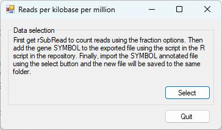

# GetRPKM

This application imports a data file created by Rsubread that contains all the reads mapping to the transcripts in a GTF file and creates a reads per transcript kilobase per million reads in the library (aligned reads). While the data in the read counts file as reads mapped to each transcrip, ***GetRPKM*** aggregates the reads to form a counts per gene. The length used to calculate the reads per kilobase is created by noting all the sequences used in the transcripts and then counting the bases used at least once: If an exon appears more than once it will be counted once. For this to work the Rsubread package must be run with the Fraction options set to true. An example command is shown below:
<pre>
> geneCounts <-featureCounts(bams, 
                             annot.ext= gtf, 
                             isGTFAnnotationFile = TRUE,   
                             useMetaFeatures=TRUE, 
                             allowMultiOverlap=TRUE,   
                             countMultiMappingReads=TRUE,  
                             fraction=TRUE, 
                             nthreads=8, 
                             ignoreDup=FALSE, 
                             isPairedEnd=TRUE,  
                             strandSpecific=2)  
</pre>

 To do this the read count file needs the gene SYMBOL appending to the file which can be done with the R script in the R_script folder. (The values of the variables on lines 7 and 8 will need to be altered to select your data etc.) 

Once the read count file has been annotated with the gene SYMBOL names, press the **Select** button and enter the file name. ***GetRPKM*** will the read the file, aggregate the data for different alternative transcripts for the same gene and then export the data to a file called **RPKM.xls** in the same folder as the dta file. 

The file is a tab-delimited text file with the *.xls file extension so double clicking it will cause Excel to open it. Because is not a 'real' *.xls file Excel will complain, but will open it as expected.